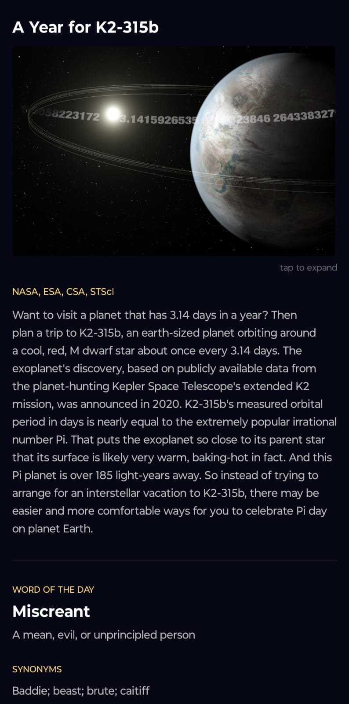

# APEXIS

A daily astronomy and vocabulary app. Once a day, APEXIS fetches NASA's Astronomy Picture of the Day and pairs it with a random English word and its definition.

Built with Python, FastAPI, PostgreSQL (previously sqlite3), and React Native.

---

## Apexis Example


---

## How it works

```
Daily script → PostgreSQL → FastAPI → Mobile app
```

- A scheduled Python script runs every day, fetching the NASA APOD and a random word from a dictionary API.
- Data is stored in a PostgreSQL database hosted on Railway, free tier ;).
- A FastAPI backend serves the data via a REST API.
- A React Native mobile app displays the data on your phone.

---

## Project structure

```
apexis/
├── index.py          # Daily pipeline script
├── backend/
│   ├── main.py       # FastAPI connect
│   ├── database.py   # Database queries
│   └── models.py     # Responses specification (pydantic)
├── apexis-app/       # React Native mobile app
│   └── App.js		  # Front end code
|
├── Procfile          # Railway start command
└── requirements.txt  # Requirements specifications for Railway dockerization
```

---

## Installation

### Download the APK (android only)

Download the latest APK from the [Releases](https://github.com/benaytms/apexis/releases/tag/1.0.2) page and install it directly.

> You may need to enable **Install from unknown sources** in your phone's settings.

---

## APIs used

- [NASA APOD API](https://api.nasa.gov/) — Astronomy Picture of the Day
- [Free Dictionary API](https://dictionaryapi.dev/) — Word definitions
- [Random Words API](https://random-words-api.kushcreates.com/) — Random English words

---

## Planned
- Push notifications for all users when daily content is updated
  (So far the notifications work only for me through Discord Hooks)

---

## Version
v.1.0.1

---
## License

MIT

